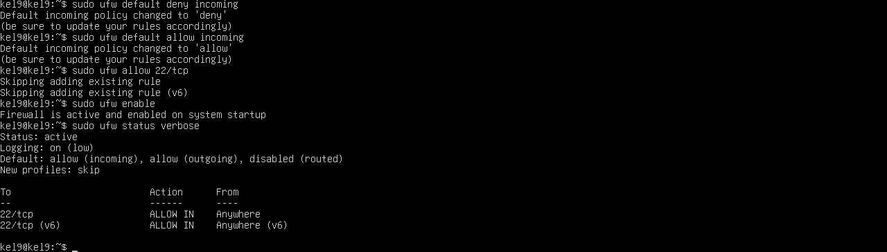
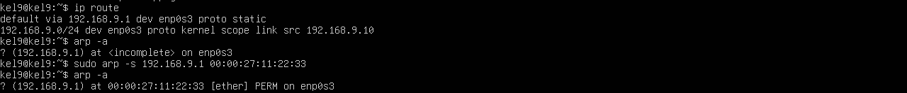
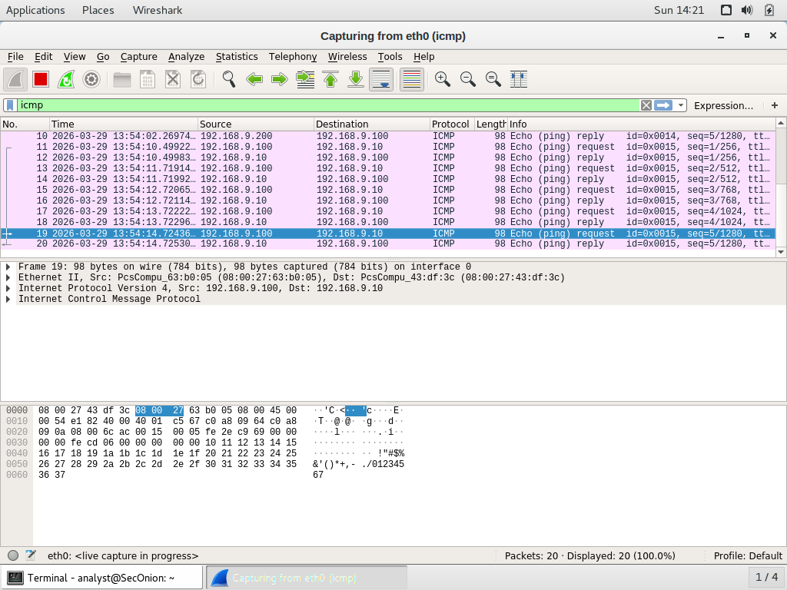
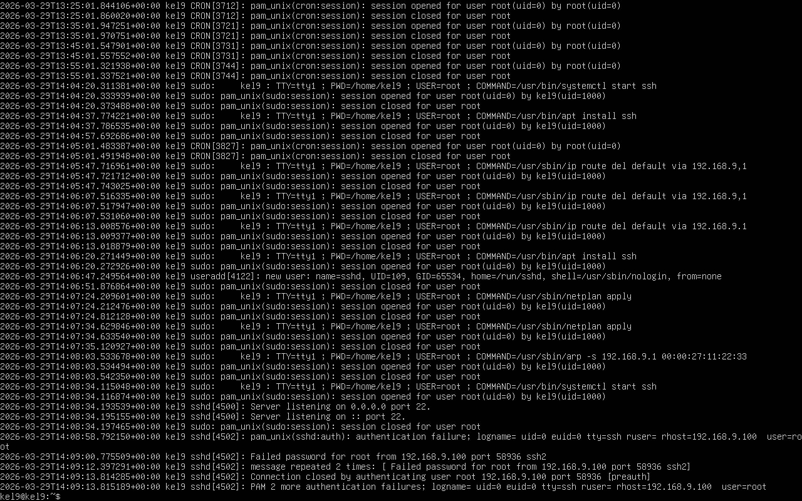

# Laporan Baseline & Hardening (Fase 1)
**Kelompok:** 09
**Skenario:** Man-in-the-Middle Hunter

## 1. Topologi Jaringan
*(Catatan: Masukkan gambar topologi logis kelompok di sini jika ada)*
- **Attacker Node:** Kali Linux (192.168.9.100)
- **Target Server:** Ubuntu Server CLI (192.168.9.10)
- **Monitoring Node:** Security Onion (192.168.9.200)

## 2. Hardening Review (Sistem "Before Attack")
Sesuai dengan skenario pencegahan ancaman Man-in-the-Middle (MITM), kami telah menerapkan penguatan sistem pada target server:
1. **Network Firewall:** Konfigurasi UFW dengan menerapkan *Default Deny* pada jalur masuk dan hanya membuka *port* esensial (Port 22). 
   - *Bukti:* 
2. **Anti-ARP Spoofing Mitigation:** Mendaftarkan MAC Address Gateway secara statis (PERM) ke dalam tabel ARP Ubuntu Server. Ini mencegah penyerang meracuni tabel *routing* lokal.
   - *Bukti:* 

## 3. Logging & Monitoring Check (Skenario Plan B)
Dikarenakan limitasi perangkat keras (RAM) yang menyebabkan *service database* Sguil/Squert mengalami *crash*, pemantauan dilakukan melalui metode *Manual Analysis* (sesuai pedoman PBL Poin 9).
1. **Analisis PCAP (Wireshark):** Pengujian pengiriman paket ICMP (Ping) dari Attacker berhasil disadap dan direkam oleh antarmuka Wireshark di Security Onion.
   - *Bukti:* 
2. **Analisis Log Manual:** Percobaan akses tidak sah (*unauthorized SSH login*) dari Attacker berhasil dicatat oleh sistem operasi target di dalam file log autentikasi.
   - *Bukti:* 